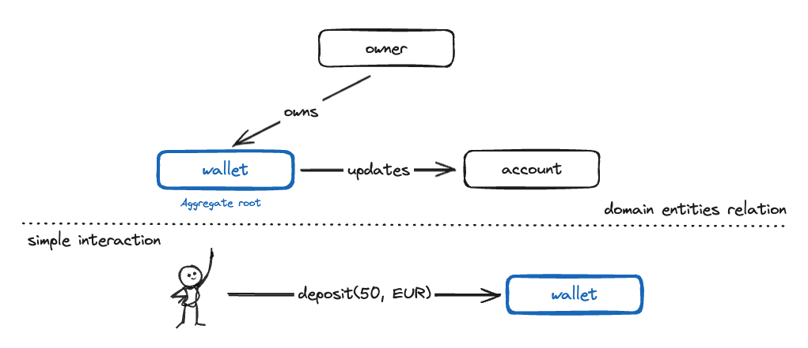

# 💰 Wallet Interaction Service 💸


[](/pom.xml)
[](/pom.xml)
[](/pom.xml)



🧪 Run tests
<br>

```shell script
./mvnw clean verify
```

📣 This project has been structured following Hexagonal Architecture principles:
https://alistair.cockburn.us/hexagonal-architecture

[//]: # (Directory tree below was generated using 'tree -d -I target' command)

```
.
├── etc
└── src
    ├── main
    │   ├── kotlin
    │   │   └── org
    │   │       └── egualpam
    │   │           └── contexts
    │   │               └── payment
    │   │                   └── walletinteractionservice
    │   │                       ├── account
    │   │                       │   └── adapters
    │   │                       │       └── in
    │   │                       │           └── controllers
    │   │                       ├── deposit
    │   │                       │   └── adapters
    │   │                       │       └── in
    │   │                       ├── shared
    │   │                       │   ├── adapters
    │   │                       │   │   └── configuration
    │   │                       │   └── application
    │   │                       │       ├── domain
    │   │                       │       │   └── exceptions
    │   │                       │       └── ports
    │   │                       │           └── out
    │   │                       └── wallet
    │   │                           ├── adapters
    │   │                           │   ├── configuration
    │   │                           │   ├── in
    │   │                           │   │   └── controllers
    │   │                           │   └── out
    │   │                           │       ├── depositexists
    │   │                           │       ├── walletexists
    │   │                           │       ├── walletrepository
    │   │                           │       │   └── springjdbccore
    │   │                           │       └── walletsearchrepository
    │   │                           │           └── springjdbccore
    │   │                           └── application
    │   │                               ├── domain
    │   │                               │   └── exceptions
    │   │                               ├── ports
    │   │                               │   └── out
    │   │                               └── usecases
    │   │                                   ├── command
    │   │                                   └── query
    │   └── resources
    │       └── db
    │           └── migration
    └── test
        ├── kotlin
        │   └── org
        │       └── egualpam
        │           └── contexts
        │               └── payment
        │                   └── walletinteractionservice
        │                       ├── architecture
        │                       ├── e2e
        │                       │   └── helper
        │                       ├── health
        │                       ├── journey
        │                       ├── shared
        │                       │   ├── adapters
        │                       │   │   └── configuration
        │                       │   └── helper
        │                       └── wallet
        │                           ├── adapters
        │                           │   ├── in
        │                           │   │   └── controllers
        │                           │   └── out
        │                           │       ├── depositexists
        │                           │       ├── walletexists
        │                           │       ├── walletrepository
        │                           │       │   └── springjdbccore
        │                           │       └── walletsearchrepository
        │                           │           └── springjdbccore
        │                           └── application
        │                               ├── domain
        │                               └── usecases
        │                                   ├── command
        │                                   └── query
        └── resources
```
