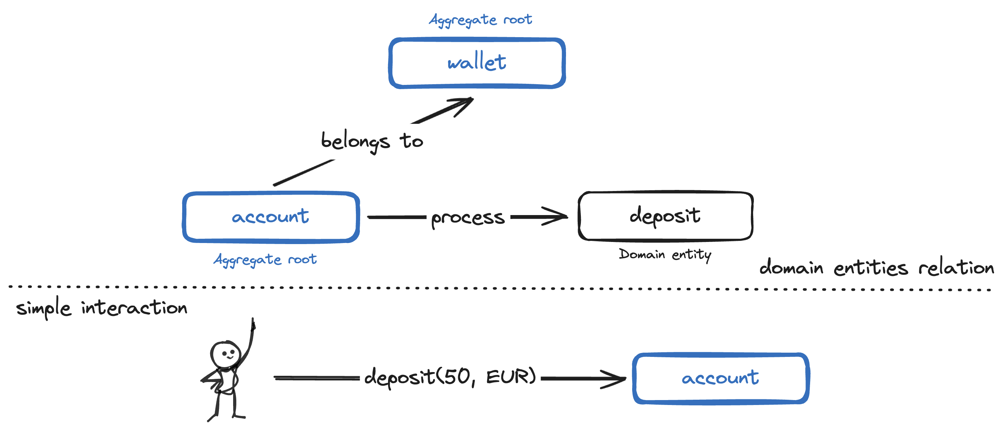

# 💰 Wallet Interaction Service 💸


[](/pom.xml)
[](/pom.xml)
[](/pom.xml)



🧪 Run tests
<br>

```shell script
./mvnw clean verify
```

---

### 📣 This project has been structured following the Hexagonal Architecture principles:

https://alistair.cockburn.us/hexagonal-architecture

[//]: # (Directory tree below was generated using 'tree -d' command in the 'src/main/kotlin/org/egualpam/contexts/payment/walletinteractionservice/wallet' directory)

💰Wallet module directory structure

```
.
├── adapters
│   ├── configuration
│   ├── in
│   │   └── controllers
│   └── out
│       ├── depositexists
│       ├── walletexists
│       ├── walletrepository
│       │   └── springjdbccore
│       └── walletsearchrepository
│           └── springjdbccore
└── application
    ├── domain
    │   └── exceptions
    └── ports
        ├── in
        │   ├── command
        │   └── query
        └── out
```

🧪 Tests directory structure

[//]: # (Directory tree below was generated using 'tree -d' command in the 'src/test/kotlin/org/egualpam/contexts/payment/walletinteractionservice' directory)

```
.
├── account
│   └── application
│       └── ports
│           └── in
│               └── command
├── architecture
├── e2e
│   └── helper
├── health
├── journey
├── shared
│   ├── adapters
│   │   └── configuration
│   └── helper
└── wallet
    ├── adapters
    │   ├── in
    │   │   └── controllers
    │   └── out
    │       ├── walletexists
    │       ├── walletrepository
    │       │   └── springjdbccore
    │       └── walletsearchrepository
    │           └── springjdbccore
    └── application
        ├── domain
        └── ports
            └── in
                ├── command
                └── query
```
